# File Analysis System — Interface Guide

Version 1.1 · the Java desktop interface, screen by screen

---

## 1. What this document covers

Every screen of the desktop application: what it shows, what you can do on it, which
and which back-end capability it reaches.

The application has **two interfaces that coexist**:

| Interface | Launch class | Purpose |
|---|---|---|
| **File Analysis System** (this guide) | `com.aegis.fdx.ui.FasApp` | Analysis and corpus work |
| **AEGIS-FDX forensic review** | `com.aegis.fdx.ui.AegisApp` | The original evidence-review UI, unchanged |

Both drive the *same* engine and the *same* case data. Neither replaces the other.

---

## 2. Layout

The window layout:

```
┌────────────────┬──────────────────────────────────────────────────────┐
│                │  Page Title                              [ Refresh ] │  ← topbar
│  FILE ANALYSIS │  Home / Breadcrumb                                   │
│  Document      ├──────────────────────────────────────────────────────┤
│  Intelligence  │                                                      │
│                │                                                      │
│  OVERVIEW      │                                                      │
│   Dashboard    │                                                      │
│   Analysis     │                 content area                         │
│   Search       │                 (cards, tables, forms)               │
│                │                                                      │
│  ENTITIES      │                                                      │
│   Sources      │                                                      │
│   Aspects      │                                                      │
│   Email Words  │                                                      │
│   Keywords     │                                                      │
│   Words        │                                                      │
│   Categories   │                                                      │
│                │                                                      │
│  FILES         │                                                      │
│   Upload Files │                                                      │
│   File Library │                                                      │
│   Import/Export│                                                      │
│                │                                                      │
│  ASSISTANT     │
│   Assistant    │
│                │
│  SYSTEM        │                                                      │
│   Saved Search │                                                      │
│   Notifications├──────────────────────────────────────────────────────┤
│   Settings     │  status message                    Offline · local   │  ← statusbar
│  v1.0.0 Offline│                                                      │
└────────────────┴──────────────────────────────────────────────────────┘
     260px fixed
```

### Design tokens

Defined once in `app/src/main/resources/com/aegis/fdx/ui/fas.css` and used by every
screen:

| Token | Value | Used for |
|---|---|---|
| `--primary-color` | `#4f46e5` | Active nav, primary buttons, links |
| `--secondary-color` | `#06b6d4` | Secondary buttons, accents |
| `--success-color` | `#10b981` | Processed / Read badges |
| `--danger-color` | `#ef4444` | Errors, destructive actions |
| `--warning-color` | `#f59e0b` | Locked, warnings |
| `--info-color` | `#3b82f6` | Informational badges |
| `--sidebar-bg` | `#1e293b` | Sidebar background |
| `--sidebar-text` | `#e2e8f0` | Sidebar labels |
| `--bg-light` | `#f8fafc` | Content canvas |
| `--card-border` | `#e2e8f0` | Card and table borders |
| `--sidebar-width` | `260px` | Sidebar width |

Icons are drawn as SVG paths in `Icons.java` — no icon font and no external asset, so
the application stays fully offline.

---

## 3. Screens

### 3.1 Dashboard
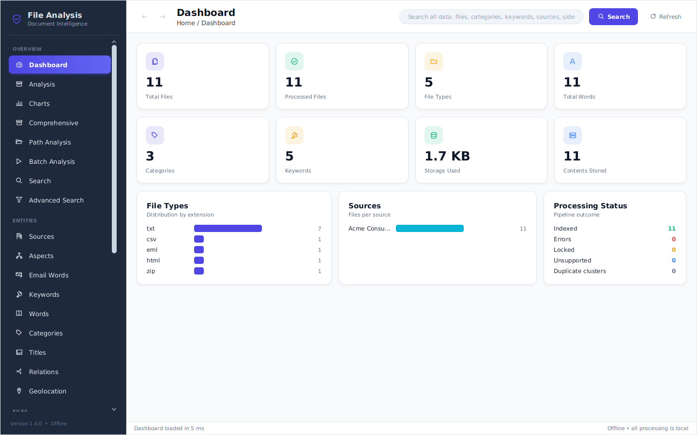

Eight stat tiles: **Total Files,
Processed Files, File Types, Total Words, Categories, Keywords, Storage Used,
Contents Stored**. Below them, three breakdown panels — File Types, Sources and
Processing Status (Indexed / Errors / Locked / Unsupported / Duplicate clusters).

Every number is read live from the engine: status counts come from the ingest
queue, storage from the element sizes, and the corpus counts from the relational
tables.

### 3.2 Analysis
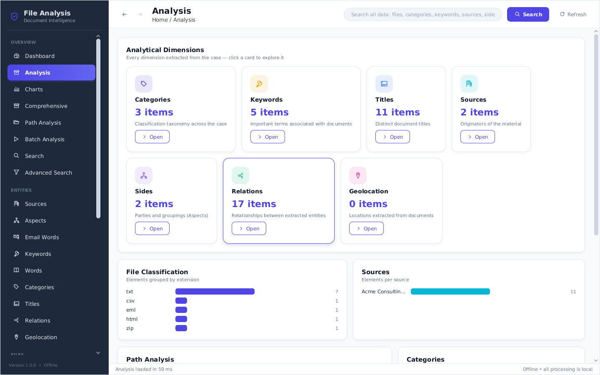

Four distribution charts — File Classification, Sources, Path Analysis and
Categories — plus a **Duplicate Analysis** table listing SHA-256 clusters.

Distributions are drawn as native bar rows rather than plotted canvases, which keeps
the application dependency-free; the series and groupings are the same either way.

Duplicates are **marked, never deleted** — a hard requirement of the forensic engine
that the UI surfaces rather than overrides.

### 3.3 Search
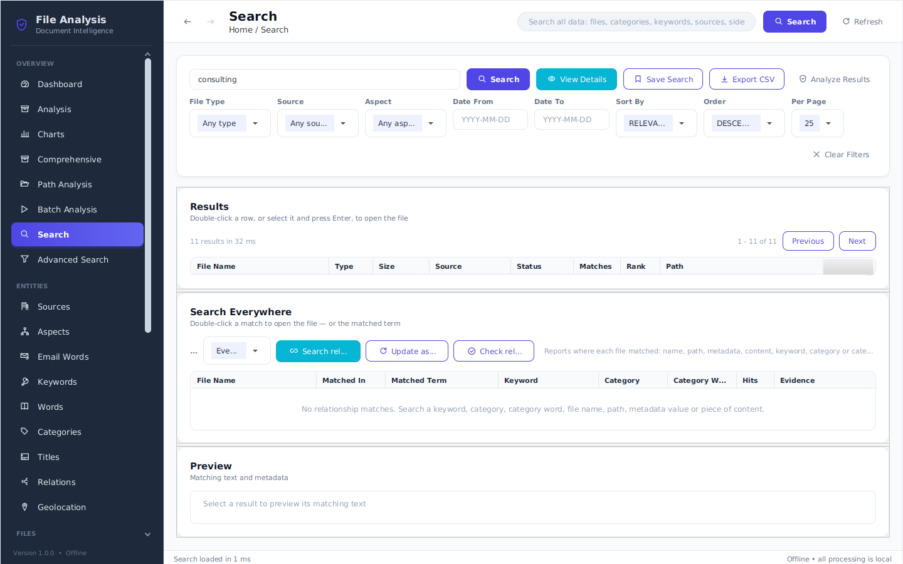

The filter bar:

| Control | Criteria method |
|---|---|
| File Type | `fileType(String)` |
| Source | `source(Integer)` |
| Aspect | `aspect(Integer)` |
| Date From / Date To | `between(LocalDate, LocalDate)` |
| Sort By | `sortBy(SortField)` — RELEVANCE, DATE, NAME, TYPE, SIZE |
| Order | `sortBy(field, SortOrder)` — ASCENDING, DESCENDING |
| Per Page | `page(index, size)` |

A search is expressed as a `SearchCriteria`:

```java
Page<SearchResultDto> hits = facades.search().search(
        SearchCriteria.of("invoice")
                .fileType("pdf")
                .source(sourceId)
                .sortBy(SortField.DATE, SortOrder.DESCENDING)
                .page(0, 50));
```

Results show File Name, Type, Size, Source, Status, Matches, Rank and Path. Selecting
a row previews the matching text and its hashes underneath. **Clear Filters**
restores every filter including the page size and re-runs the search, so stale
results never linger.

Below the results, **Search Everywhere** reports where each file matched — name,
path, metadata, content, keyword, category or category word — scoped by the Scope
box. **Update associations** re-derives the file↔term links and **Check
relationships** verifies them; both run off the interface thread so the window never
freezes.

Opening a result resolves its forensic element id through the case database to the
exact registered file — never by name, so two files that share a name still open the
record the index matched. Use the **View Details** button, double-click the row, or
select it and press Enter. A result with no registered file reports itself in words
instead of navigating anywhere. In Search Everywhere, double-clicking a match opens
the file for name, path, metadata and content matches, and the matched term's own
detail destination for keyword, category and category-word matches.

The query grammar is the full AEGIS one — phrases, wildcards, `term~` fuzzy,
`"a b"~5` proximity, `AND/OR/NOT` with parentheses, field queries and `/regex/`.
An invalid query is reported inline; it never silently returns nothing.

**Save Search** stores the query; **Export CSV** writes a UTF-8 BOM CSV. Every
executed search is written to the history table.

### 3.4 Sources
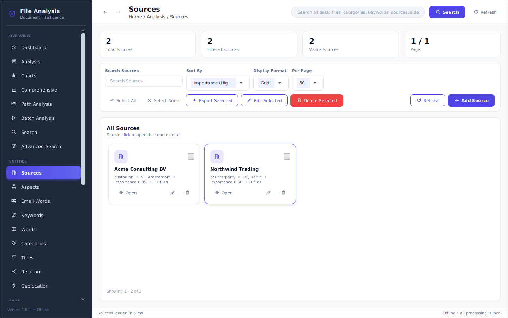

Table of all sources with search, plus view / duplicate / delete per row. The create
form captures:

Source Name\*, Job/Type\*, Importance\*, Country\*, City, Description, Social Media
Accounts, Attachments, Notes, Ownership, Access Status, Date of Source Discovery,
Category.

Importance is validated to 0.0–1.0 and names are unique, matching the reference
constraints.

### 3.5 Aspects

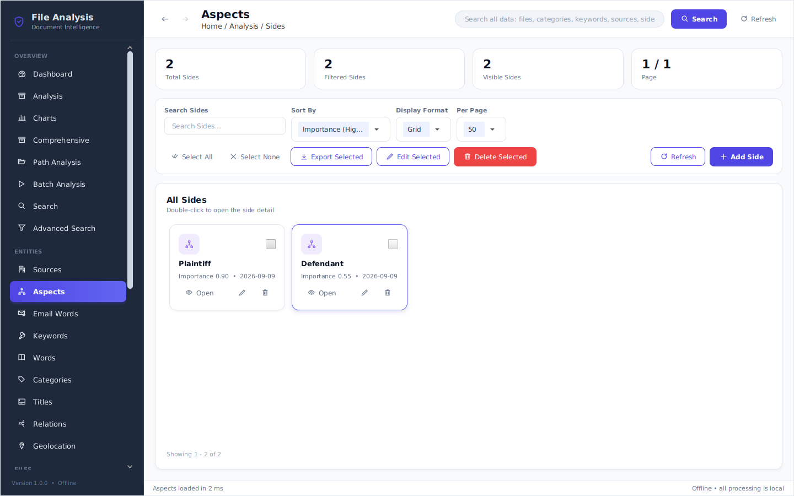

Name, Importance and Date of Creation, with duplicate and delete actions. An aspect
is the party, grouping or viewpoint material belongs to, and is the second half of the
mandatory attribution recorded during processing.

> Earlier revisions called this concept a "side". The name is now **Aspect**
> throughout; `SideFacade` remains as a deprecated alias so existing callers keep
> working.

### 3.6 Email Words
Lists the email elements the pipeline extracted — EML, MSG, PST, OST and MBOX — with
their source and path.

### 3.7 Keywords
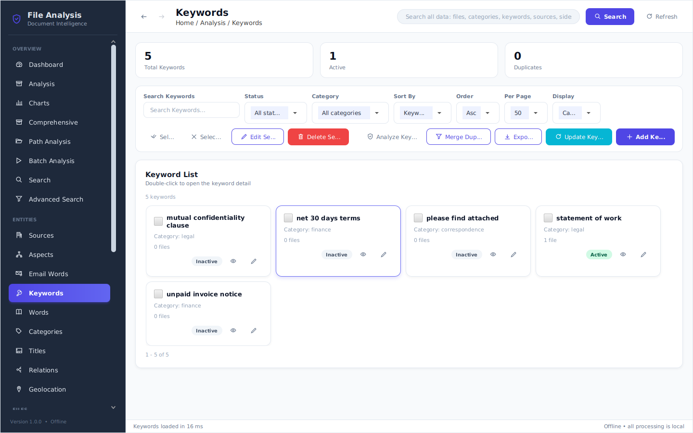

Paged keyword list with the owning category. Supports add, inline edit, delete,
multi-select bulk delete and **Find Duplicates**. Each keyword must belong to an
existing category; attaching one to an unknown category is rejected.

### 3.8 Words
Summary tiles (Total Words / In Files / Unused) above a paged, searchable word list
with per-page selection (25/50/100/200), inline rename, delete and bulk delete.
Double-clicking a word opens its detail destination.

### 3.9 Categories
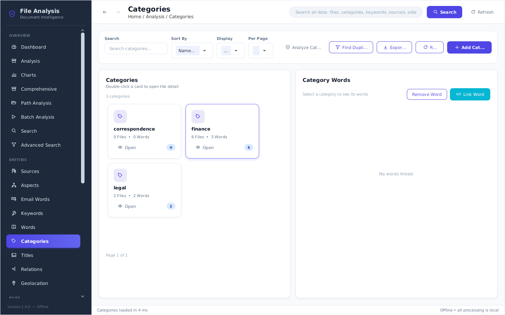

Two-pane layout: categories on the left, the selected category's linked
words on the right, with **Link Word** to attach one.

### 3.10 Upload Files
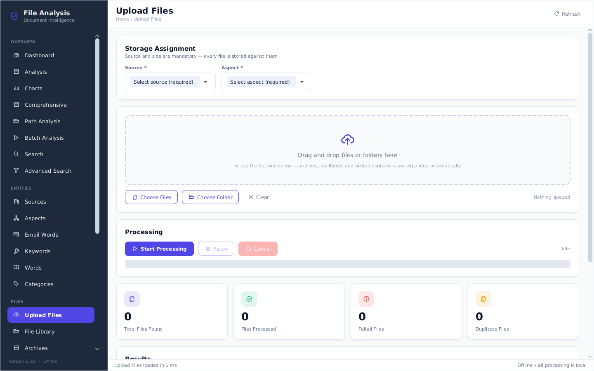

- **Storage Assignment** — Source and Side, both mandatory. Processing will not start
  until both are chosen, mirroring the reference contract where `storage_source` and
  `storage_side` are required.
- **Drop zone** — drag and drop files or folders, or browse. Archives, mailboxes and
  nested containers are expanded automatically to the configured depth.
- **Processing** — Start / Pause / Cancel with a progress bar.
- **Stats** — Total Files Found, Files Processed, Failed Files, Duplicate Files.
- **Results** — one row per discovered file, **including failures**.

Reading, extraction, hashing, OCR and metadata are all performed by the existing
AEGIS pipeline. This screen drives it and then registers the results into the
relational model.

### 3.11 File Library
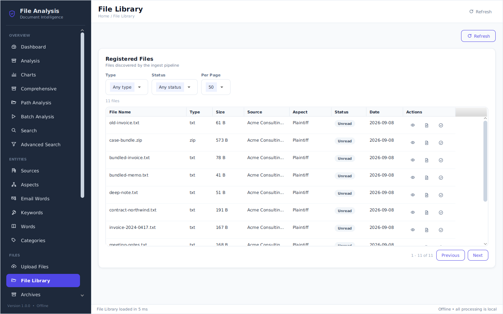

Columns: File Name, Type, Size, Source, Aspect, Status, Date, Actions. Filter by type and Read/Unread status, with paging.

Per row: **view details** (full metadata including SHA-256, coordinates and the
linked element id), **view content** (the stored extracted text) and **toggle
Read/Unread**.

### 3.12 Import / Export
Export the file registry as CSV, Excel or JSON; export keywords, settings, or a
database backup ZIP. Import validates a backup, loads settings, or ingests a CSV file
list.

Backup import is **validate-only**: it reports what an archive contains without
mutating the case. Asking it to restore raises an explicit unsupported error rather
than silently doing nothing.


### 3.13 Assistant

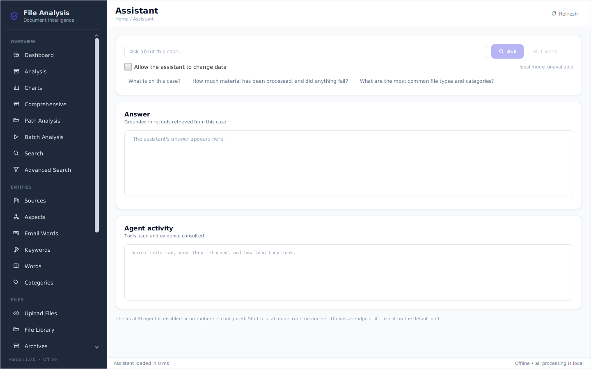

A local analysis assistant. Ask a question in plain language; it searches, reads and
correlates case records by calling application tools, then answers with the records it
consulted listed underneath.

- **Answer** — the response, grounded in retrieved records. If nothing relevant was
  found, it says so rather than guessing.
- **Records consulted** — chips naming every real record behind the answer
  (`item E-000001`, `source 1`), so any claim can be checked.
- **Agent activity** — which tools ran, with what arguments, their outcome and timing.
- **Allow the assistant to change data** — off by default. While off the assistant is
  strictly read-only. When on, it may additionally classify files and set review state;
  it can never alter original material, extracted text or hashes.
- **Suggestions** — one-click questions appropriate to the current screen.

Everything runs on this machine. No case data is sent anywhere. If no local model
runtime is installed the screen says so and the rest of the application is unaffected.

Full detail — model selection, tools, safety boundary, offline verification:
**[AI_AGENT.md](AI_AGENT.md)**.

### 3.14 Saved Searches
Saved searches with use counts on the left; recent search history on the right, with
Clear History.

### 3.15 Notifications
Unread / Active stat tiles and Upcoming Events, with a table of all notifications
carrying type, priority badge, title, message and timestamp. Mark-as-read and dismiss
per row; filter by unread or hide dismissed.

### 3.16 Settings
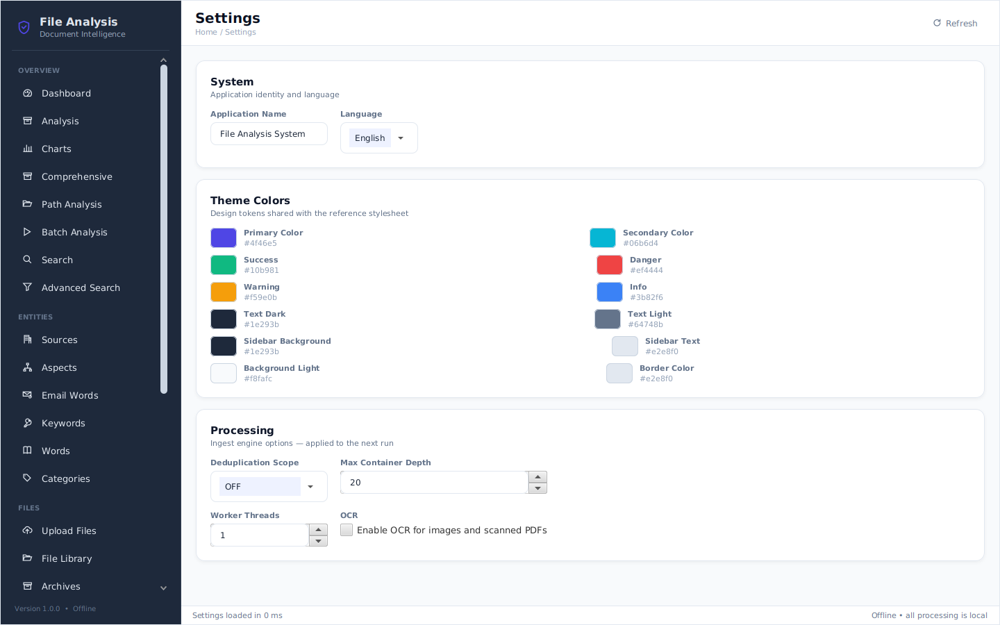

- **System** — the application name, the interface language, the open case and its
  folder, shown as facts rather than as fields. The reference offers an editable name
  and a language picker; only the English catalogue is installed here, so presenting a
  picker would be presenting a control that changes nothing.
- **Theme Colors** — the live design-token palette with hex values.
- **Processing** — deduplication scope, max container depth, worker threads and the
  OCR toggle. These write straight through to the engine's `CaseSettings`, and are
  saved to `settings.properties` in the case folder as you change them: the line under
  the card names the file and the time it was written. Reopening the case reapplies
  them before anything can be processed. Container passwords are held for the session
  only and are never written to disk.

---

---

## 4. Destinations added after the reference audit

The sixteen destinations below were identified by a full audit of the reference
project (see [REFERENCE_AUDIT.md](REFERENCE_AUDIT.md)) and were missing from the
earlier build.

### 4.1 Charts

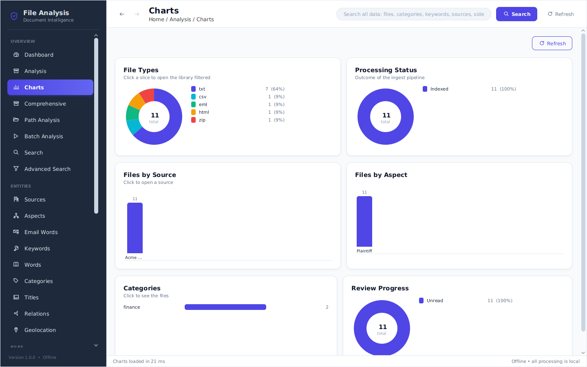

Six live distributions — file types, processing status, files by source, files by
aspect, categories and review progress — as canvas-drawn donut and bar charts.
Clicking a slice drills through: a file type opens the library filtered to it, a
source opens that source's detail destination.

### 4.2 Comprehensive Dashboard

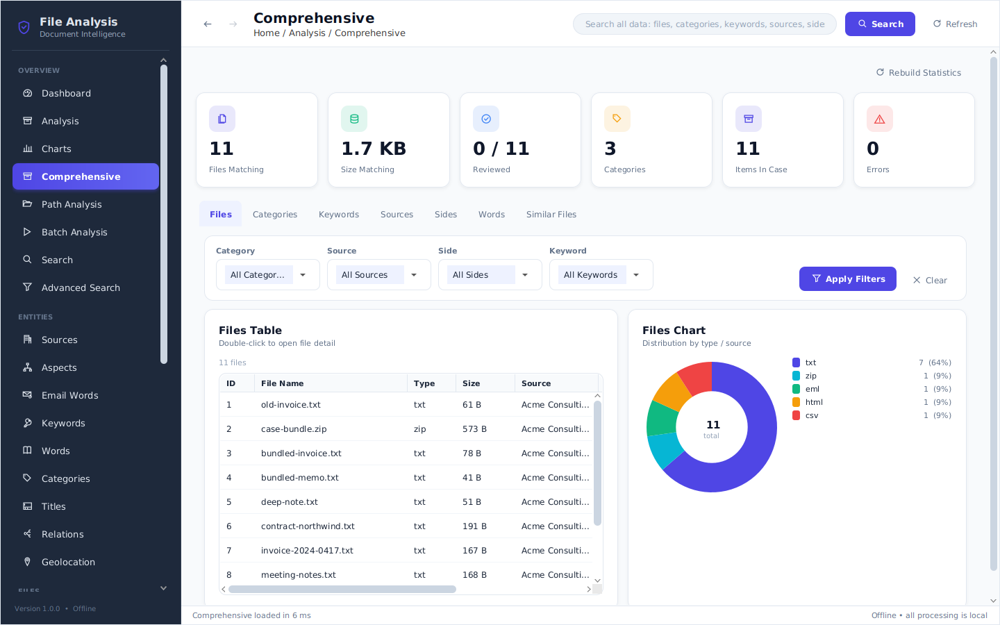

Every dimension under one combined filter. Narrowing by source, aspect, category and
file type recomputes the tiles and all five breakdown tables together, so the figures
stay mutually consistent.

### 4.3 Path Analysis

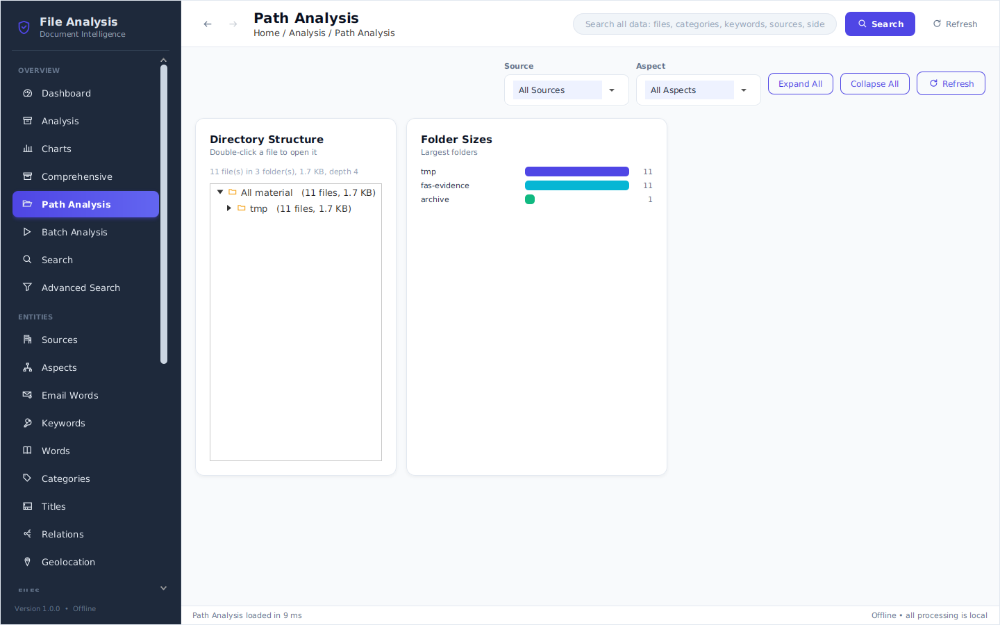

The directory structure of everything registered, as a tree with rolled-up file counts
and byte totals per folder. Filterable by source and aspect; double-clicking a file
opens its detail destination.

### 4.4 Advanced Search

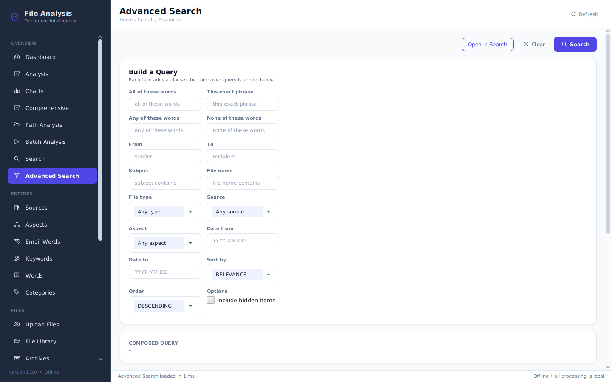

A field-by-field query builder: all of these words, this exact phrase, any of these
words, none of these words, from, to, subject, file name, type, source, aspect, dates.
The composed query is shown live, so the builder teaches the query language rather
than hiding it, and "Open in Search" hands the expression to the plain search
destination.

### 4.5 Archives

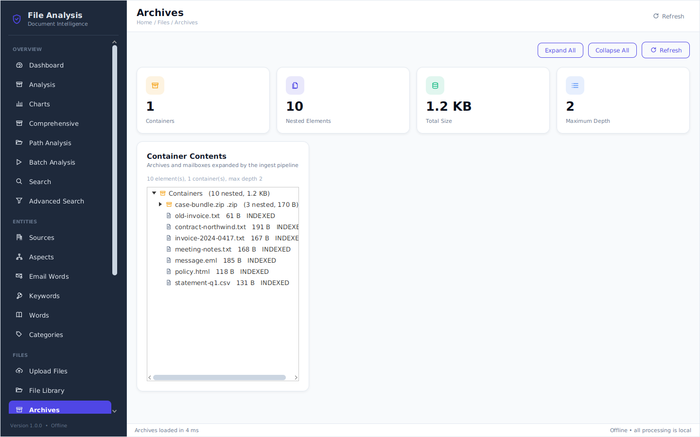

Containers and their nested contents, built from the engine's own `parentId`/`depth`
model — what an archive or mailbox expanded into, at what depth. This is a capability
the reference application does not have; it is surfaced here rather than discarded.

### 4.6 Source Detail

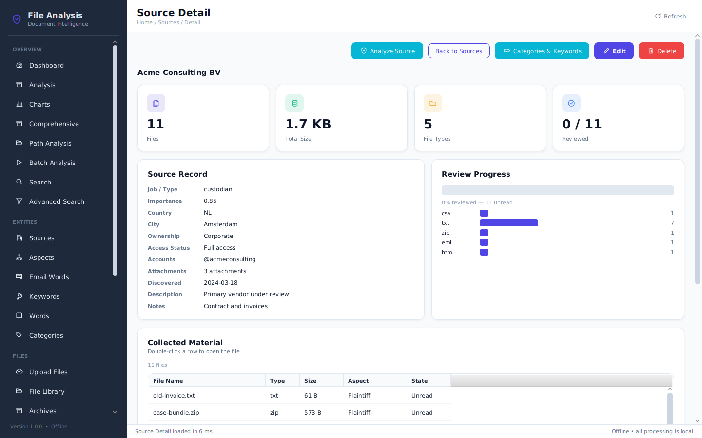

Everything known about one source: the full record, computed statistics (files, size,
type count, review progress), the material collected from it, and the categories and
keywords appearing in that material. Edit and delete act here; the collected
material shows file cards (source, side, size, date, extension) with a selection
checkbox and **View Details** / **Full View** / **Download** per card,
Select All / None and a **Download Selected** bundle above the table.
Double-clicking a card or a row opens the file.

### 4.7 Aspect Detail

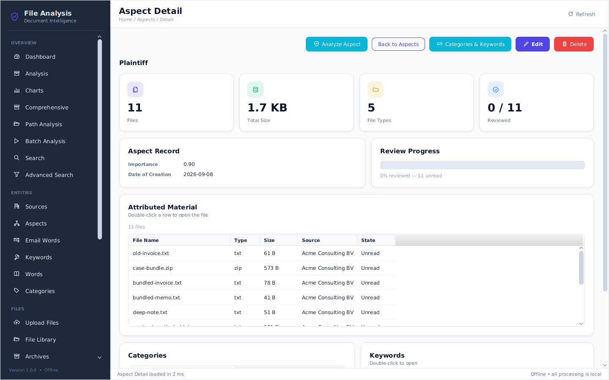

The same treatment for an aspect, including the file cards and the
**Download Selected** bundle over its attributed material.

### 4.8 Source and Aspect Relationships

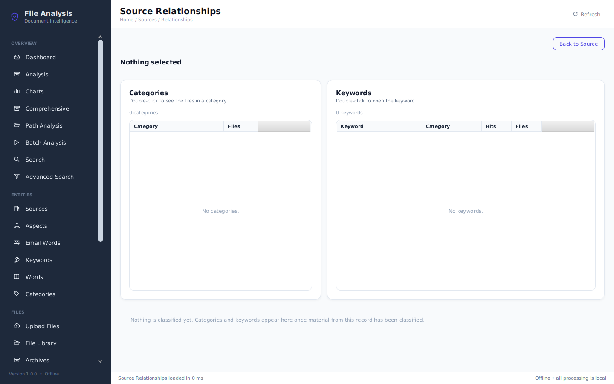

The categories and keywords associated with one source or aspect, with file counts and
hit totals. Double-clicking drills through to the category's files or the keyword's
detail.

### 4.9 File Detail

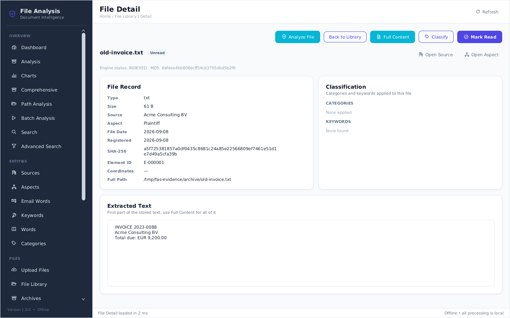

One registered file in full: metadata, SHA-256, the originating engine element and its
processing status, applied categories and keyword hits, and a preview of the extracted
text. Mark read, classify, and navigate to the source or aspect from here.

### 4.10 Full Content

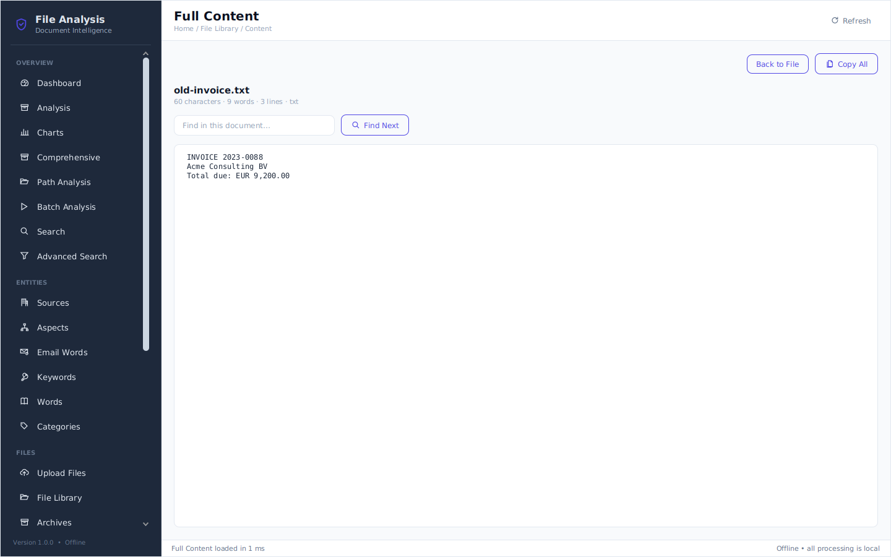

The complete extracted text, with in-document find (wrapping, case-insensitive, with a
match count) and copy-all. Separate from File Detail because reading a long document
is its own task.

### 4.11 Word and Keyword Detail

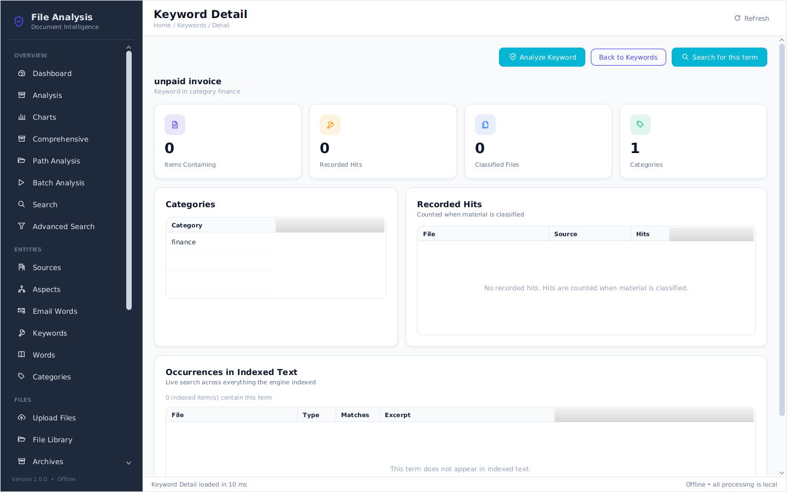

A term, the categories it belongs to, the files carrying it with per-file hit counts,
and a live occurrence search across everything indexed. The recorded-hit table and the
live index search are shown separately, because they answer different questions.

### 4.12 Processing Monitor

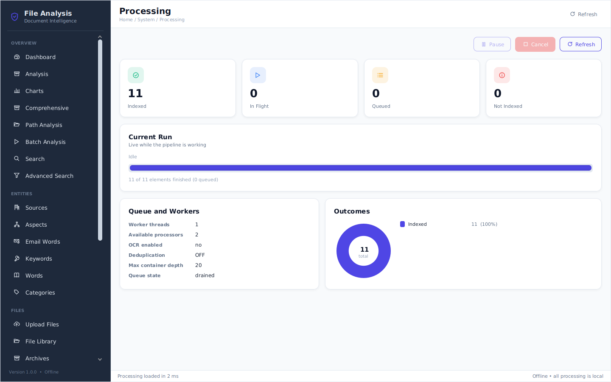

Live pipeline state: queue depth, elements in flight, worker configuration and
outcomes. Polls every two seconds while visible and stops when you leave. Pause and
cancel act on a running ingest.

### 4.13 Error Dashboard

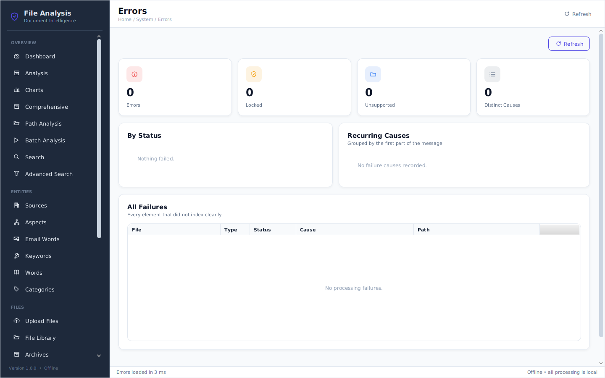

Everything that did not index cleanly, grouped by status and by normalised cause so
recurring problems stand out, with the full list underneath. Surfaces `Item.errors()`,
which the engine has always recorded but which no destination previously displayed.

### 4.14 Performance

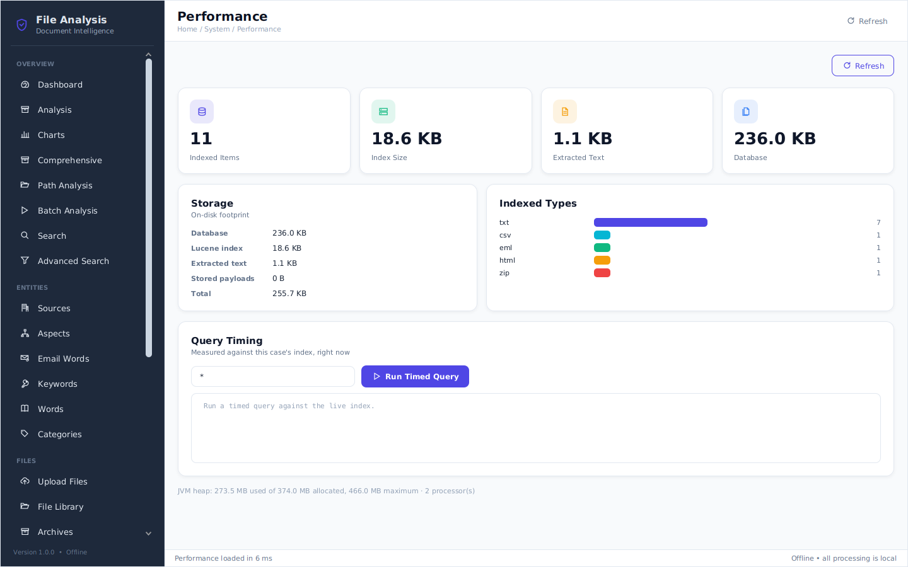

Storage footprint, index size, heap use, and a query timer that runs a real search
against the live index five times and reports best, median and worst — measured here
and now, not quoted from a benchmark.

**Host Resources** sits below the storage cards: process CPU, system CPU, JVM heap,
system memory and the capacity of the volume holding the case, sampled from the
operating system every two seconds while the page is open and stopped the moment you
navigate away. Where a platform does not publish a counter, the row says so — "not
reported by this operating system" — instead of drawing a bar. The reference
application shows the same three meters as fixed literals (45%, 62%, 38%); these are
readings, so on an idle machine they will read low, and during ingestion they move.

### 4.15 Setup

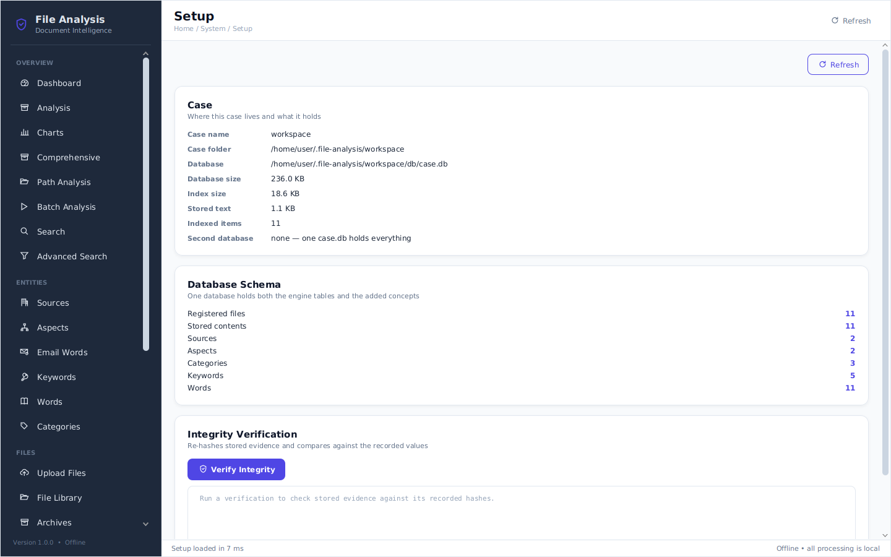

Case paths and sizes, schema counts, and integrity verification. The reference
application's setup page configures a database connection; a case here is
self-contained, so this shows the equivalent status instead of asking for connection
details that do not exist.


### 4.16 Batch Analysis

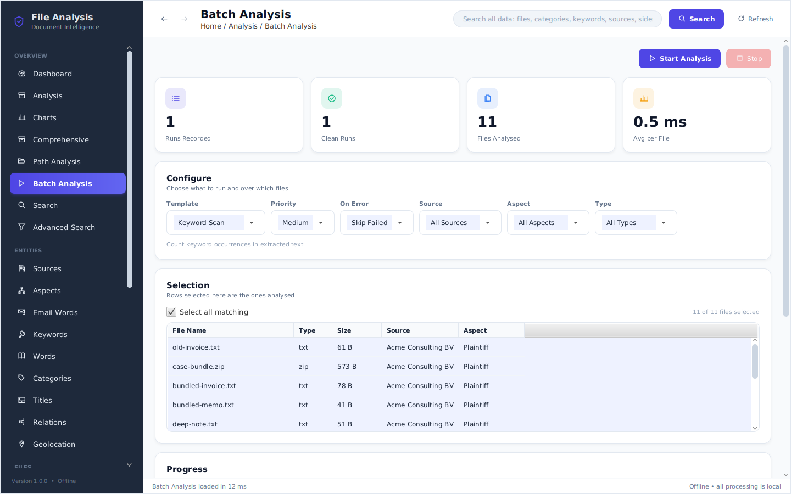

Run an analysis over a chosen set of files and keep a record of what each run found.

- **Templates** — Keyword Scan (count occurrences in extracted text), Classification
  (apply categories whose term appears), Deep Analysis (both), Recount.
- **Priority and error policy** — recorded against the run; Stop on Error halts at the
  first failure, Skip Failed continues.
- **Selection** — filter by source, aspect and type, then tick the rows to analyse.
- **Progress** — live per-file progress, with Stop.
- **History** — every run persisted with counts, success rate, average speed and a
  per-file outcome list. Select a run to inspect it, re-run it, or delete it.

This is where keyword hit counts come from. They are computed by scanning the text the
engine already extracted — nothing is seeded, and nothing re-reads original evidence.

Distinct from the Processing Monitor: that shows what the ingest pipeline is doing
now; this applies an analysis to a selection and remembers the outcome.

---

## 5. Data model added for integration

The five added concepts are first-class and live in the case database itself,
`<case>/db/case.db`, alongside the engine tables:

```
source ──┐
         ├──< path >──< content
aspect ──┘    │
              ├── hash
              ├──< path_category >── category ──< keyword
              └──< path_keyword  >──┘
                                    └── word

alert     search_history     saved_search
```

`paths` is the bridge. Each row carries `source_id`, `aspect id`, the real SHA-256 via
`hashs`, and `element_id` — the AEGIS element it was derived from. `contents` holds
the extracted text for that path.

**The forensic schema was not modified.** `CaseDatabase` (items, ingest queue, tags,
audit log) is untouched and keeps every existing caller.

### How the two halves connect

```
  Upload Files screen
          │
          ▼
  FileProcessingFacade ──► ingest pipeline         (unchanged:
          │                  reading, extraction,   hashing, OCR,
          │                  metadata, indexing)
          ▼
  ContentFacade.registerIngestedItems(sourceId, aspectId)
          │
          ▼
  hash → path → content           ← what the file screens read
```

Registration is idempotent: re-running after another ingest adds only new elements.

---

## 5. Keyboard and interaction notes

- Pressing **Enter** in the search box runs the search.
- Tables support multi-select where bulk actions exist (Words, Keywords).
- Destructive actions always confirm first ("Delete Confirmation", "This cannot be
  undone").
- The topbar **Refresh** re-reads the current screen from the engine.
- All processing is local; the status bar states this permanently.

---

## 6. Verifying the interface yourself

The screenshots in this guide are generated, not drawn. To reproduce them:

```bash
# 1. seed a workspace by running the real pipeline over sample evidence
java -cp "build/classes:$CP" FasSeedHarness

# 2. launch the real app headlessly and capture every screen
java -Dglass.platform=Monocle -Dmonocle.platform=Headless -Dprism.order=sw \
     --module-path $FX --add-modules javafx.controls,javafx.swing \
     --patch-module javafx.graphics=/path/to/openjfx-monocle.jar \
     -cp "/tmp/shot:build/classes:$CP" FasShotHarness docs/screens-fas
```

`FasShotHarness` launches `FasApp` itself and walks the real navigation, so a
screenshot can only be produced if the screen actually renders.
$CP" FasShotHarness docs/screens-fas
```

`FasShotHarness` launches `FasApp` itself and walks the real navigation, so a
screenshot can only be produced if the screen actually renders.
